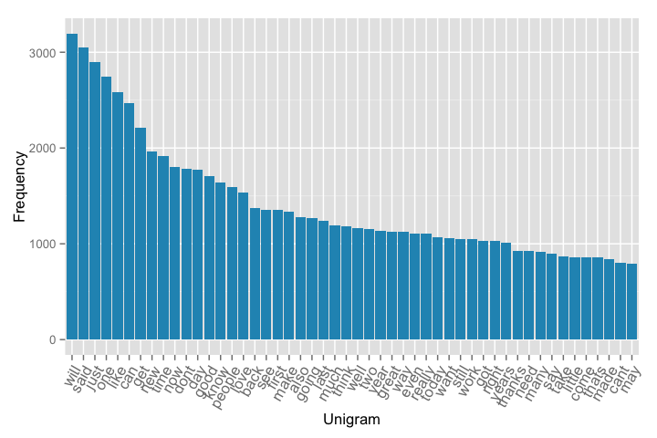
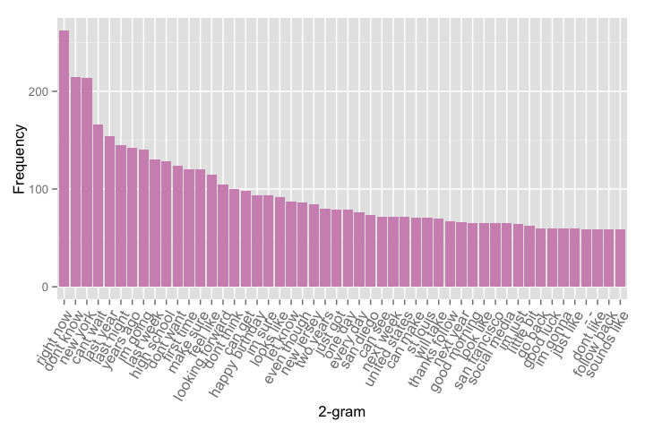
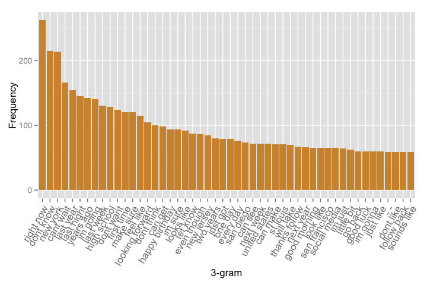
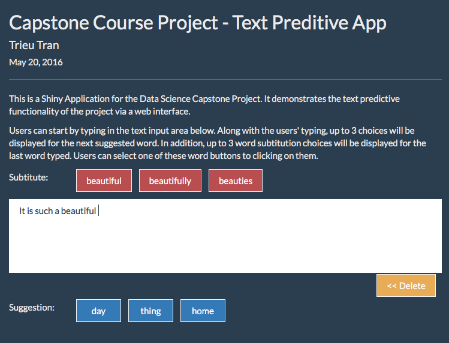

Data Science Capstone - Text Predictive Shiny Application (Draft)
========================================================
author: Trieu Tran 
date: May 30, 2016

First Slide (Draft)
========================================================

For more details on authoring R presentations click the
**Help** button on the toolbar.

- Bullet 1
- Bullet 2
- Bullet 3

Text data (Draft)
========================================================

Source: [https://d396qusza40orc.cloudfront.net/dsscapstone/dataset/Coursera-SwiftKey.zip](https://d396qusza40orc.cloudfront.net/dsscapstone/dataset/Coursera-SwiftKey.zip)

Text files:

File            | Size          | Lines         | Words
----------------|---------------|---------------|-------------
blogs	        | 201M          | 899,288       | 37,334,114
news	        | 197M          | 1,010,242     | 34,365,936
twitter	        | 160M	        | 2,360,148	| 30,359,804

Text Corpus Overview (Draft)
========================================================

Text Predictive Algorithm (Draft)
========================================================
- N-gram models
- Modified Kneser-Ney Smoothing
- Backoff strategy

App Usage (Draft)
========================================================
- Users can start by typing in the text input area below. Along with the users' typing, up to 3 choices will be displayed for the next suggested word.In addition, up to 3 word subtitution choices will be displayed for the last word typed. Users can select one of these word buttons to clicking on them.
- [linktoapp](linktoapp)

